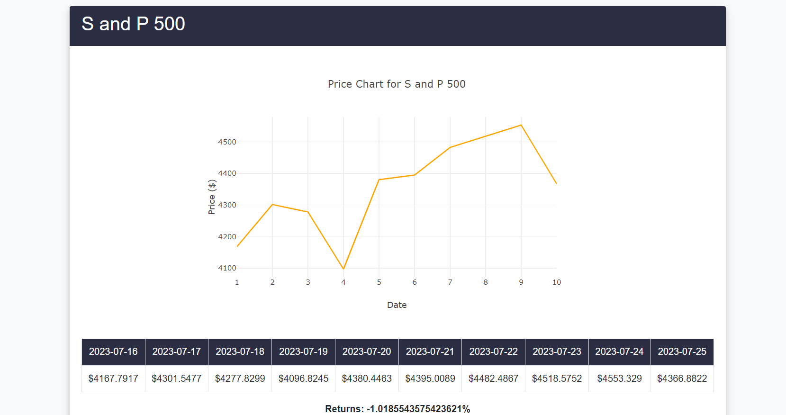

# Django Stock Prediction App

## Overview

This is a Django web application that predicts stock prices for five different companies (AAPL, GOOG, AMZN, PLTR, and TSLA) using machine learning models. The app fetches historical stock data using the Yahoo Finance API, trains three models (Random Forest, K-Nearest Neighbors, and an Ensemble model), and displays the past 5 days and the next 10 days of stock prices in a tabular format.

## Features

- Fetches historical stock data from Yahoo Finance API
- Implements three machine learning models: Random Forest, K-Nearest Neighbors, and Ensemble model
- Displays past 5 days and forecasted next 10 days of stock prices for each company
- Responsive and user-friendly design

## Installation

1. Clone the repository
2. Install required packages
3. python manage.py runserver.
4. Train models by clicking the button so you can get the recent data.

## Usage
-Visit the homepage to see the stock predictions for the specified companies.
-The table displays past 5 days of historical stock prices and the forecasted next 10 days of stock prices.
-Scroll horizontally within the table to view the full content.
## Technologies Used
-Django
-Pandas
-NumPy
-Scikit-learn
-yfinance
